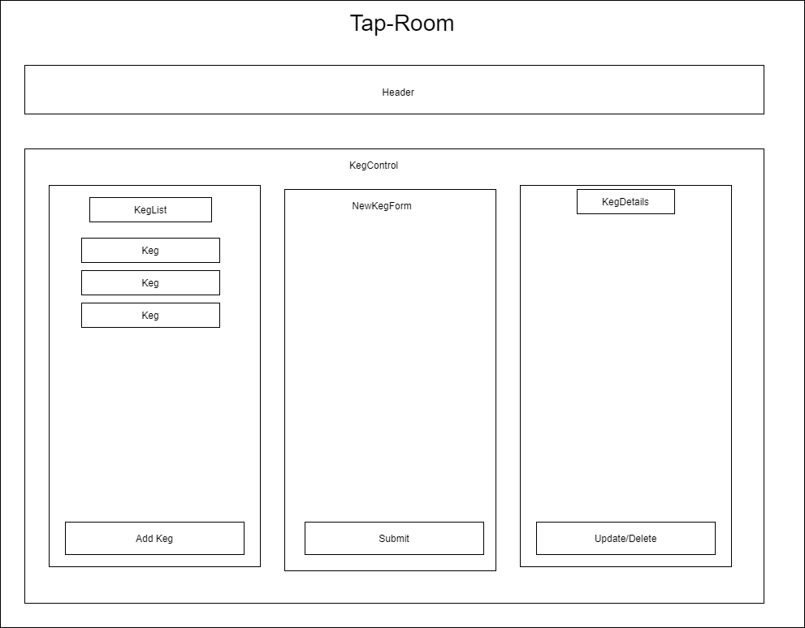

<br>
<p align="center">
  <u><big>|| <b>Tap-Room</b> ||</big></u>
</p>
<p align="center">
    <!-- Project Avatar/Logo -->
    <br>
     <a href="https://github.com/dschaaf89/Tap-Room">
        
    </a>
    </a>
    <p align="center">
      ___________________________
    </p>
    <!-- GitHub Link -->
    <p align="center">
        <a href="https://github.com/dschaaf89">
            <strong>Daniel Schaaf</strong>
        </a>
    </p>
    <!-- Project Shields -->
    <p align="center">
        <a href="https://github.com/dschaaf89/Tap-Room/graphs/contributors">
            
        </a>
        ¨
        <a href="https://github.comdschaaf89/Tap-Room/stargazers">
            
        </a>
        ¨
        <a href="https://github.com/dschaaf89/Tap-Room/issues">
            
        </a>
        ¨
        <a href="https://github.com/dschaaf89/Tap-Room/blob/master/LICENSE.txt">
            
        </a>
        ¨
    </p>
</p>
<p align="center">
  <small>Initiated 11/20/2020.</small>
</p>

<!-- Project Links -->
<p align="center">
    <a href="https://github.com/dschaaf89/Tap-Room"><big>Project Docs</big></a> ·
    <a href="https://github.com/dschaaf89/Tap-Room/issues"><big>Report Bug</big></a> ·
    <a href="https://github.com/dschaaf89/Tap-Room/issues"><big>Request Feature</big></a>
</p>
------------------------------

### <u>Table of Contents</u>
* <a href="#🌐-about-the-project">About the Project</a>
    * <a href="#📖-description">Description</a>
    * <a href="#🦠-known-bugs">Known Bugs</a>
    * <a href="#🛠-built-with">Built With</a>
    <!-- * <a href="#🔍-preview">Preview</a> -->
* <a href="#🏁-getting-started">Getting Started</a>
    * <a href="#📋-prerequisites">Prerequisites</a>
    * <a href="#⚙️-setup-and-use">Setup and Use</a>
* <a href="#🤝-contributors">Auxiliary</a>
    * <a href="#🤝-contributors">Contributors</a>
    * <a href="#✉️-contact-and-support">Contact</a>
    * <a href="#⚖️-license">License</a>
    * <a href="#🌟-acknowledgements">Acknowledgements</a>
    
------------------------------
## 🌐 About the Project

### 📖 Description

This react app is built based on the following diagram. Users are able to add new keg records and details which are displayed in a list. List items can be selected which display the keg details where they can be deleted, or pints can be sold. If pints reach 0, they will stop decrimenting and remain empty.




### 🦠 Known Bugs


* When pints are sold on a keg, it moves to the bottom of the keg list
* when User chooses Edit keg, the form comes up but when you select update keg, it says throws an error.
### 🛠 Built With
* [Visual Studio Code](https://code.visualstudio.com/)
* [React](https://reactjs.org/docs/getting-started.html)
* HTML
* CSS
* Bootstrap


<!-- ### 🔍 Preview -->

------------------------------

## 🏁 Getting Started/Design Process

 

### 📋 Prerequisites
1. Clone this repository onto your computer:
    "git clone https://github.com/dschaaf89/Tap-Room"
2. Navigate into the "Tap-Room" directory in Visual Studio Code or preferred text editor:
3. Open the project by typing "code ." while in the previous directory in your terminal.
4. Open your computer's terminal and navigate to the directory bearing the name of the program and containing the top level subdirectories and files.
5. Type "npm install" in your console to install necessary dependencies and allow use of the following scripts.

This project was bootstrapped with [Create React App](https://github.com/facebook/create-react-app).

## Available Scripts

In the project directory, you can run:

### `npm start`

Runs the app in the development mode.<br />
Open [http://localhost:3000](http://localhost:3000) to view it in the browser.

The page will reload if you make edits.<br />
You will also see any lint errors in the console.

### `npm test`

Launches the test runner in the interactive watch mode.<br />
See the section about [running tests](https://facebook.github.io/create-react-app/docs/running-tests) for more information.

### `npm run build`

Builds the app for production to the `build` folder.<br />
It correctly bundles React in production mode and optimizes the build for the best performance.

The build is minified and the filenames include the hashes.<br />
Your app is ready to be deployed!

See the section about [deployment](https://facebook.github.io/create-react-app/docs/deployment) for more information.

### `npm run eject`

**Note: this is a one-way operation. Once you `eject`, you can’t go back!**

If you aren’t satisfied with the build tool and configuration choices, you can `eject` at any time. This command will remove the single build dependency from your project.

Instead, it will copy all the configuration files and the transitive dependencies (webpack, Babel, ESLint, etc) right into your project so you have full control over them. All of the commands except `eject` will still work, but they will point to the copied scripts so you can tweak them. At this point you’re on your own.

You don’t have to ever use `eject`. The curated feature set is suitable for small and middle deployments, and you shouldn’t feel obligated to use this feature. However we understand that this tool wouldn’t be useful if you couldn’t customize it when you are ready for it.

## Learn More

You can learn more in the [Create React App documentation](https://facebook.github.io/create-react-app/docs/getting-started).

To learn React, check out the [React documentation](https://reactjs.org/).

### Code Splitting

This section has moved here: https://facebook.github.io/create-react-app/docs/code-splitting

### Analyzing the Bundle Size

This section has moved here: https://facebook.github.io/create-react-app/docs/analyzing-the-bundle-size

### Making a Progressive Web App

This section has moved here: https://facebook.github.io/create-react-app/docs/making-a-progressive-web-app

### Advanced Configuration

This section has moved here: https://facebook.github.io/create-react-app/docs/advanced-configuration

### Deployment

This section has moved here: https://facebook.github.io/create-react-app/docs/deployment

### `npm run build` fails to minify

This section has moved here: https://facebook.github.io/create-react-app/docs/troubleshooting#npm-run-build-fails-to-minify
 #### Code Editor

  To view or edit the code, you will need an code editor or text editor. The popular open-source choices for an code editor are Atom and VisualStudio Code.

  1) Code Editor Download:
     * Option 1: [Atom](https://nodejs.org/en/)
     * Option 2: [VisualStudio Code](https://www.npmjs.com/)
  2) Click the download most applicable to your OS and system.
  3) Wait for download to complete, then install -- Windows will run the setup exe and macOS will drag and drop into applications.
  4) Optionally, create a [GitHub Account](https://github.com)

### ⚙️ Setup and Use

1. Clone this repository onto your computer:
    "git clone https://github.com/dschaaf89/Tap-Room"
2. Navigate into the "Tap-Room" directory in Visual Studio Code or preferred text editor:
3. Open the project by typing "code ." while in the previous directory in your terminal.
4. Open your computer's terminal and navigate to the directory bearing the name of the program and containing the top level subdirectories and files.
5. Type "npm install" in your console to install necessary dependencies and allow use of the following scripts.

This project was bootstrapped with [Create React App](https://github.com/facebook/create-react-app).


### 🤝 Contributors

| Author | GitHub | Email |
|--------|:------:|:-----:|
| [Daniel Schaaf](https://linkedin.com/in/danielschaaf) | [dschaaf89](https://github.com/dschaaf89) |  [Daniel.schaaf@outlook.com](mailto:Daniel.schaaf@outlook.com) |


------------------------------

### ✉️ Contact and Support

If you have any feedback or concerns, please contact one of the contributors.

------------------------------

### ⚖️ License

This project is licensed under the [MIT License](https://opensource.org/licenses/MIT). Copyright (C) 2020 Daniel Schaaf and William Donovan-Seid. All Rights Reserved.
```
MIT License

Copyright (c) 2020 **_Daniel Schaaf_**

Permission is hereby granted, free of charge, to any person obtaining a copy
of this software and associated documentation files (the "Software"), to deal
in the Software without restriction, including without limitation the rights
to use, copy, modify, merge, publish, distribute, sublicense, and/or sell
copies of the Software, and to permit persons to whom the Software is
furnished to do so, subject to the following conditions:

The above copyright notice and this permission notice shall be included in all
copies or substantial portions of the Software.

THE SOFTWARE IS PROVIDED "AS IS", WITHOUT WARRANTY OF ANY KIND, EXPRESS OR
IMPLIED, INCLUDING BUT NOT LIMITED TO THE WARRANTIES OF MERCHANTABILITY,
FITNESS FOR A PARTICULAR PURPOSE AND NONINFRINGEMENT. IN NO EVENT SHALL THE
AUTHORS OR COPYRIGHT HOLDERS BE LIABLE FOR ANY CLAIM, DAMAGES OR OTHER
LIABILITY, WHETHER IN AN ACTION OF CONTRACT, TORT OR OTHERWISE, ARISING FROM,
OUT OF OR IN CONNECTION WITH THE SOFTWARE OR THE USE OR OTHER DEALINGS IN THE
SOFTWARE.
```

------------------------------

### 🌟 Acknowledgments

#### [Epicodus](https://www.epicodus.com/)
>"A school for tech careers... to help people learn the skills they need to get great jobs."

#### [The Internet](https://lh3.googleusercontent.com/proxy/6QlFHq-RHi9-Jd7pjdpwFdWMTYy5y26LesKZG-TO7rD3ZCh2BESLUzktpd27TAXSiGd19f8B3AxMn5Nbos1g6QCHAQOTrvVsAVnqS7RKSCQLV6s)
> "...The Internet is becoming the town square for the global village of tomorrow..."
> - Bill Gates

------------------------------

<center><a href="#">Return to Top</a></center>


